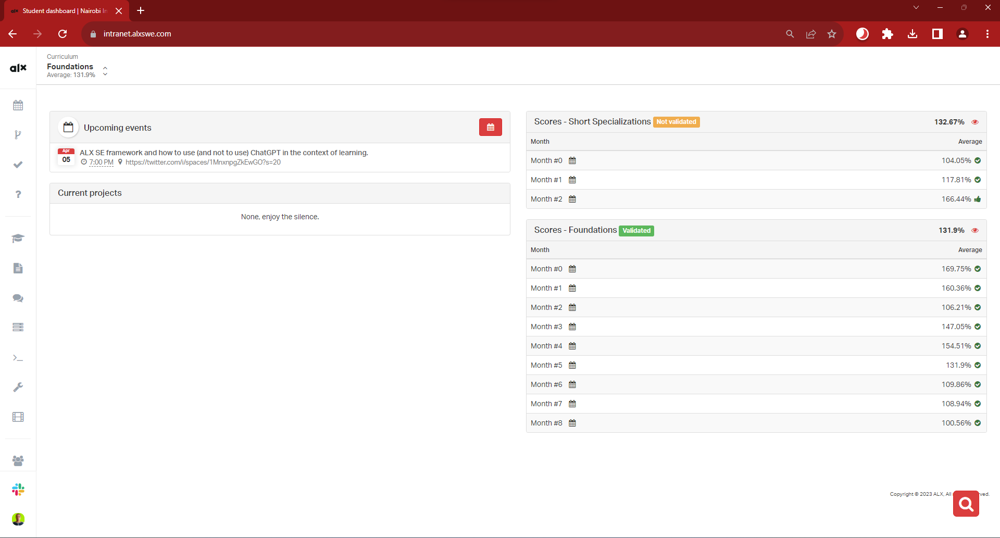
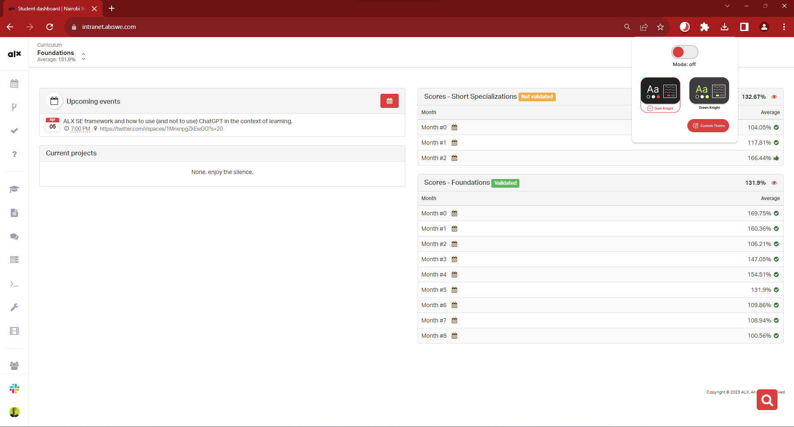
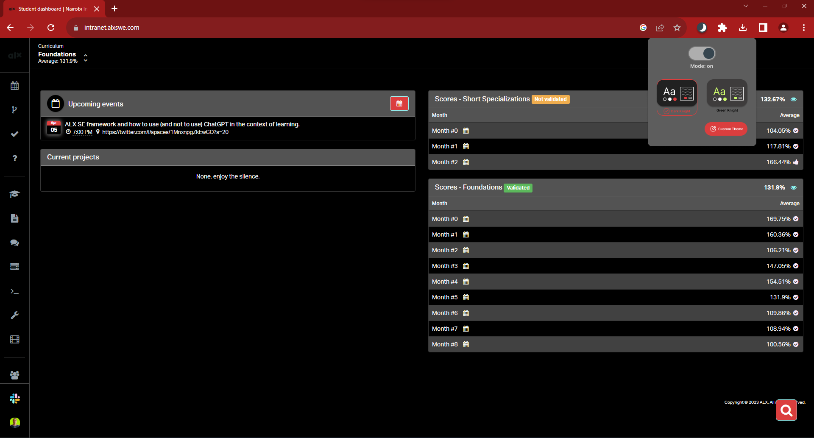

# Minimum Viable Product for ALX Dark Mode Extension.

## 💼 Executive Summary.
The ALX Dark Mode Extension is a free and open-source browser extension that provides a dark mode feature for the ALX intranet platform. This extension helps students who prefer to use the dark mode feature to switch to dark mode easily. Additionally, using dark mode can help reduce eye strain and improve the overall health of the user.

## 💡 Problem Statement.
The ALX intranet platform does not currently have a dark mode feature, which can be problematic for students who prefer using the dark mode feature. Additionally, extended use of the platform can lead to eye strain and other health issues.

## 🎯 Target Market.
The target market for this product is ALX Academy students and other users of the ALX intranet platform who prefer to use dark mode.

## 💰 Value Proposition.
The ALX Dark Mode Extension offers a valuable solution to a common problem experienced by users of the ALX intranet platform. By providing a dark mode feature, the extension can help reduce eye strain and improve the overall health of the user.

## 📝 Feature List.
1. Dark mode feature for the ALX intranet platform.
1. Easy installation for Chrome and Firefox.
1. Open-source and free to use.

## 🏢 Project System Architecture.

_Fig 1: Architectural Digram for ALX Dark Mode Extension_

## 👤 User Persona.
Name: John

Age: 25

Occupation: Student

Interests: Technology, Programming, Music

Pain Points: Struggles with eye strain after prolonged use of the ALX intranet platform, would like to have a dark mode feature to reduce eye strain and improve overall health.

## 🛣️ User Journey.
1. John is a student who frequently uses the ALX intranet platform.
1. John experiences eye strain after prolonged use of the platform.
1. John discovers the ALX Dark Mode Extension and decides to install it.
1. John follows the installation instructions and installs the extension.
1. John now has the option to switch to dark mode on the ALX intranet platform.
1. John uses the dark mode feature to reduce eye strain and improve his overall health.

## 🛠️ Technical Requirements.
1. Ability to create and distribute browser extensions.
1. Familiarity with web development technologies such as HTML, CSS, and JavaScript.
1. Access to web hosting services to distribute the extension.

## 💼 Business Model .
1. The ALX Dark Mode Extension is a free and open-source product. The business model for the product is centered around community contributions and support.

## 📈 Marketing Plan.
1. Promote the extension on social media platforms, such as Twitter and LinkedIn.
1. Encourage user contributions through the GitHub repository.
1. Collaborate with ALX Academy to promote the extension to their students.

## 📊 Key Performance Indicators.
1. Number of downloads and installations of the extension.
1. Number of contributions and pull requests from the community.
1. User feedback and reviews.

## 📅 Timeline. 
1. Week 1-2: Develop and test the dark mode feature for the ALX intranet platform.
1. Week 3-4: Create the browser extensions and test on Chrome and Firefox.
1. Week 5-6: Publish the extension to the respective browser extension stores.
1. Week 7-8: Promote the extension on social media and encourage community contributions.

## 💸 Budget.
* Development: (community contributions).
* Marketing:  (social media advertising).
* Operational: (community contributions).

## ⚠️ Risks and Assumptions.
* Risk: Lack of community contributions and support.
  * Mitigation: Promote the extension and actively encourage contributions.
* Risk: Compatibility issues with different operating systems and browsers.
  * Mitigation: Extensive testing and bug fixes to ensure compatibility.
* Assumption: ALX Academy students will be interested in using the extension.
  * Mitigation: Gather feedback and user data to validate the assumption.

## 🎨 Mockups and Wireframes.

_Fig 2: ALX Intranet with extension off._

_Fig 3: ALX Intranet with extension off and extension popup visible._

_Fig 2: ALX Intranet with extension on and dark mode applied_

## 🏁 Conclusion.

The ALX Dark Mode Extension provides a valuable solution to a common pain point experienced by ALX Academy students. The extension's unique selling proposition is its ease of use and compatibility with different operating systems and browsers. The project's success will be measured by its downloads, user engagement, and community contributions.
